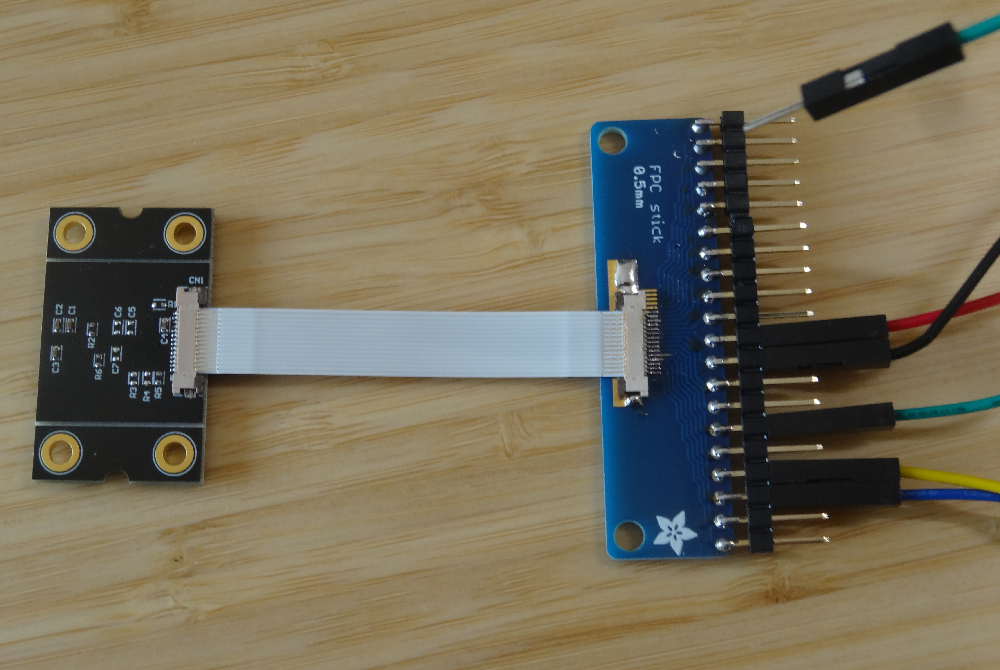

`107-Arduino-TMF8801`
=====================

  

Arduino library for the [AMS](https://ams.com) [TMF8801](https://ams.com/tmf8801) time-of-flight sensor.

This library works for
* [ArduinoCore-samd](https://github.com/arduino/ArduinoCore-samd): [`Arduino Zero`](https://store.arduino.cc/arduino-zero), [`MKR 1000`](https://store.arduino.cc/arduino-mkr1000-wifi), [`MKR WiFi 1010`](https://store.arduino.cc/arduino-mkr-wifi-1010), [`Nano 33 IoT`](https://store.arduino.cc/arduino-nano-33-iot), [`MKR GSM 1400`](https://store.arduino.cc/arduino-mkr-gsm-1400-1415), [`MKR NB 1500`](https://store.arduino.cc/arduino-mkr-nb-1500-1413), [`MKR WAN 1300/1310`](https://store.arduino.cc/mkr-wan-1310) :heavy_check_mark:
* [ArduinoCore-mbed](https://github.com/arduino/ArduinoCore-mbed): [`Portenta H7`](https://store.arduino.cc/portenta-h7), [`Nano 33 BLE`](https://store.arduino.cc/arduino-nano-33-ble), [`Nano RP2040 Connect`](https://store.arduino.cc/nano-rp2040-connect), [`Edge Control`](https://store.arduino.cc/edge-control) :heavy_check_mark:
* [arduino-esp32](https://github.com/espressif/arduino-esp32): `ESP32 Dev Module`, `ESP32 Wrover Module`, ... :heavy_check_mark:

### Hardware
#### Breakout/Development-Board
* [TMF8801Breakout](https://github.com/generationmake/TMF8801Breakout)
* [TMF8801-DB](extras/doc/TMF8801-Daughter-Card-Schematic-Rev-B.pdf)

#### How to connect the TMF8801-DB breakout board
The following hardware items are required:
* 1 x [TMF8801-DB](extras/doc/TMF8801-Daughter-Card-Schematic-Rev-B.pdf)
* 1 x [Adafruit FPC Stick](https://www.adafruit.com/product/1325)
* 1 x [Molex FPC Connector 0545501471](https://www.molex.com/molex/products/part-detail/ffc_fpc_connectors/0545501471)
* 1 x [Molex FPC Cable 0152660141](https://www.molex.com/molex/products/part-detail/cable/0152660141)

  

| **Colour** | **Function** | **Arduino Zero Pin** |
|:----------:|:------------:|:--------------------:|
| Red        |    3V3       | 3.3V                 |
| Black      |    GND       | GND                  |
| Green      |    INT       | D2                   |
| Yellow     |    SCL       | SCL                  |
| Blue       |    SDA       | SDA                  |
